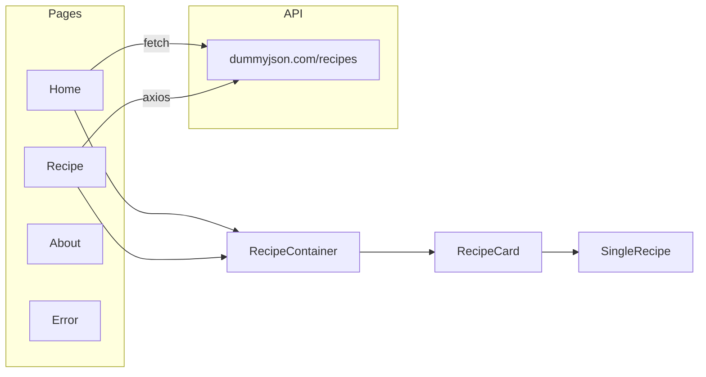

# Recipe Book

A single-page **React** application for browsing recipes from a public API. It was built during a **3-day React.js workshop** (starter project provided by the organizers), then extended with routing, data fetching, search, and a polished UI using **Material UI (MUI)**.

---

## What this app does

| Feature | Description |
|--------|-------------|
| **Home** | Hero section with background image, live search, and a grid of recipe cards loaded from the API. |
| **Recipes** | Dedicated page that loads recipes with **Axios**, shows a loading spinner while fetching, and filters the list as you type (with a short delay for UX). |
| **Recipe detail** | Clicking a card opens a **modal** with full details: image, tags, ingredients, and expandable **instructions** list. |
| **About** | Marketing-style page with mission text and feature highlights. |
| **404** | Unknown routes show a friendly “page not found” view. |
| **Layout** | Shared **navigation bar** and **footer** on all pages. |

**Data source:** [DummyJSON Recipes API](https://dummyjson.com/docs/recipes) (`https://dummyjson.com/recipes`) — sample recipes with images, ratings, ingredients, and instructions.

---

## How it works (architecture)

1. **Entry:** `src/index.js` mounts `<App />` with React 18’s `createRoot` and `StrictMode`.
2. **Routing:** `src/App.js` wraps the UI in `BrowserRouter` from **React Router v6**. Routes:
   - `/` → `Home.jsx`
   - `/about` → `About.jsx`
   - `/recipe` → `Recipe.jsx`
   - `/*` (catch-all) → `Error.jsx`
3. **State & data:**
   - **Home** uses `useState` + `useEffect` and the browser **`fetch`** API to load recipes once on mount, then passes `recipes` and `search` into `RecipeContainer`.
   - **Recipe** uses **`axios.get`** for the same endpoint, tracks `loading`, and debounces search input slightly before updating filter state.
4. **Presentation:** `RecipeContainer` filters by recipe **name** or **cuisine** (case-insensitive) and maps each item to `RecipeCard`. `RecipeCard` uses local state to control a MUI **`Modal`** and passes the selected recipe into `SingleRecipe`.



---

## Tech stack

| Technology | Role in this project |
|------------|----------------------|
| **React 18** | UI with function components, hooks (`useState`, `useEffect`). |
| **Create React App** (`react-scripts`) | Dev server, build, and test runner without manual Webpack config. |
| **React Router DOM v6** | Client-side routes (`Routes`, `Route`, `Link`, `BrowserRouter`). |
| **MUI v5** (`@mui/material`, `@mui/icons-material`) | Pre-built accessible components, icons, layout, and theming helpers. |
| **Emotion** (`@emotion/react`, `@emotion/styled`) | Default **CSS-in-JS** engine used by MUI v5 under the hood. |
| **Axios** | HTTP client on the Recipe page (alternative to `fetch`). |
| **Styled Components** | Present in `package.json`; MUI in this repo primarily uses the **Emotion** path (`sx`, `styled` from `@mui/material/styles`). |

---

## Material UI (MUI) — explained

**MUI** (formerly “Material-UI”) is a library of **ready-made React components** (buttons, cards, dialogs, grids, typography, etc.) styled with a design system inspired by Google’s **Material Design**. You import components and compose them like normal React elements instead of writing all CSS from scratch.

### Why you see `@emotion/*` in `package.json`

MUI v5’s default styling is **CSS-in-JS** powered by **Emotion**. When you use `<Box sx={{ ... }}>` or `styled()` from MUI, styles are generated at runtime and scoped to your components. You do **not** have to write separate `.css` files for every MUI prop (though you still can for global styles like `index.css`).

### The `sx` prop (used everywhere in this repo)

`sx` is a shorthand for **one-off styles** that also understands the **theme** (spacing units, palette colors, breakpoints).

Examples from this project:

- **Layout & responsive design:** `flexDirection: { xs: "column", sm: "row" }` in `SingleRecipe.jsx` means “column on extra-small screens, row from `sm` and up.”
- **Theme tokens:** `color: 'primary.main'`, `bgcolor: 'background.paper'` tie colors to the MUI theme instead of hard-coding hex everywhere.
- **Spacing:** `p: 2`, `mb: 4` use the theme’s spacing scale (by default `1` = 8px).

*“We use MUI’s `sx` prop for responsive, theme-aware styling without maintaining a large set of custom CSS modules.”*

### `styled` from `@mui/material/styles`

In `SingleRecipe.jsx`, `styled` wraps native elements or MUI components to create **reusable styled components** that can read `theme` (typography, spacing, transitions). The `ExpandMore` button is a styled `IconButton` whose rotation depends on the `expand` prop.

*“For repeated or animated patterns we used MUI’s `styled` API so the component stays readable and still accesses the theme.”*


## Project structure (high level)

```
src/
  App.js                 # Router + layout shell
  index.js               # React root
  Pages/
    Home.jsx             # Hero + search + list
    Recipe.jsx           # Axios + search + list
    About.jsx
    Error.jsx
  components/
    NavBar.jsx
    Footer.jsx
    RecipeContainer.jsx  # Filter + grid
    RecipeCard.jsx       # Card + modal trigger
    SingleRecipe.jsx     # Detail inside modal
  Assets/Images/
```

---

## Getting started

**Requirements:** Node.js and npm (versions compatible with Create React App).

```bash
npm install
npm start
```

Open [http://localhost:3000](http://localhost:3000). The dev server hot-reloads on save.

| Script | Purpose |
|--------|---------|
| `npm start` | Development server |
| `npm run build` | Production build in `build/` |
| `npm test` | Jest + React Testing Library |

---

## Acknowledgement

Starter structure and workshop brief were provided by the **React.js workshop** organizers; implementation, UI composition, and README documentation reflect learning and iteration during and after the program.
